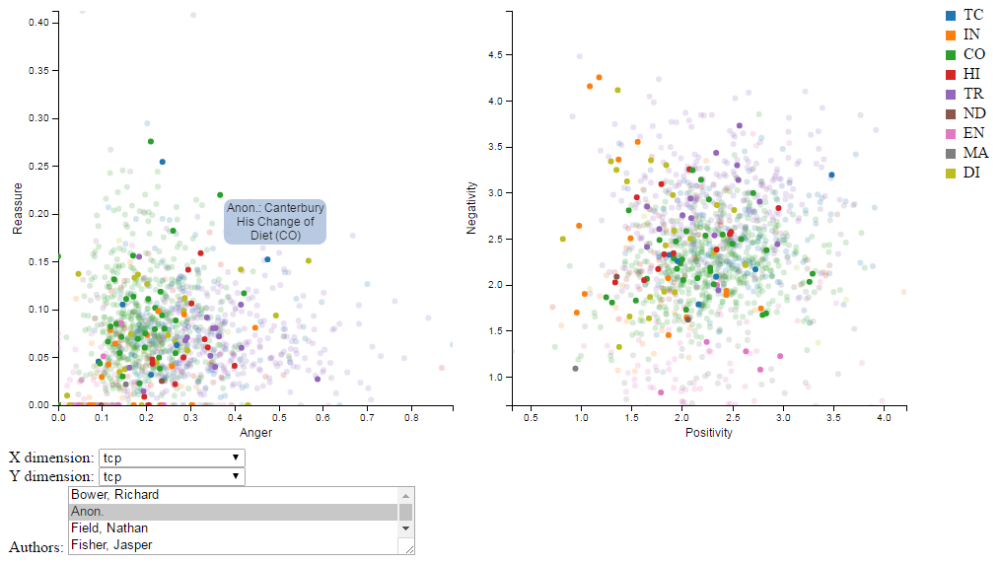

# d3-twodim

d3-twodim is a **D3.v3.js** module for creating two-dimensional representations of data for end-user exploration.  Currently, d3-twodim can instantiate scatterplots using SVG, Canvas, or WebGL, and will (in the future) instantiate visualization techniques such as Splatterplots and subsampled scatterplots. This module uses a factory design pattern to keep d3-twodim components linked to one another in order to interchange data, data item state, and user interaction.

This project is under active development.  Please feel free to [file an issue](https://github.com/uwgraphics/d3-twodim/issues), open a pull request, or [contact the author](http://twitter.com/yelperalp/) with any feedback.  If you use d3-twodim in your own project, [we would love to hear about it](http://twitter.com/yelperalp)!



[**View a live example on the GitHub-hosted project page**](http://uwgraphics.github.io/d3-twodim/), or build the source and navigate to the `examples/` folder in a webserver.

## Installing

Download the [latest release](https://github.com/uwgraphics/d3-twodim/releases/latest), and include d3-twodim as a script source after including d3.v3.js. If you use NPM, `npm install d3-twodim`. Otherwise, you can modify and rebuild the library by calling `npm install` from the project root.  

## Example Instantiation

You can view an example instantiation within the repository by navigating to [simpleExample.html](examples/simpleExample.html) after building the library.

d3-twodim uses the factory design pattern to keep track of all linked components.  In your code, first create the factory by calling `new d3_twodim.twoDimFactory()`, then create objects using the factory's `createComponent()` method.  To make your first scatterplot, you can simply do the following:

```javascript
var twoDFactory = new d3_twodim.twoDimFactory();
var scatterplot = twoDFactory.createComponent({type: 'scatterplot'})
  .width(400).height(400);

// set the data
twoDFactory.setData([[1,1],[2,2],[3,3]);
d3.select('body').append('svg')
  .attr('width', 500).attr('height', 500)
  .append('g')
    .attr('class', 'scatterplot')
    .attr('transform', 'translate(50,50)')
    .call(scatterplot, '.scatterplot');
```

The real power comes from linking components together -- for example, you could have one scatterplot looking at the first two dimensions of your data, and the next scatterplot looking at two other dimensions.  When you brush over one scatterplot, the corresponding points in the other scatterplot also update.

```javascript
var scatterplot = twoDFactory.createComponent({type: 'scatterplot'})
  .width(400).height(400)
  .doBrush(true)
  .fields(["dim1", "dim2"]);
  
var scatterplot2 = twoDFactory.createComponent({type: 'scatterplot'})
  .width(400).height(400)
  .doBrush(true)
  .fields(["dim3", "dim4"]);
  
svg.append('g')
  .attr('class', 'scatterplot')
  .attr('transform', 'translate(50,50)')
  .call(scatterplot, '.scatterplot');

svg.append('g')
  .attr('class', 'scatterplot2')
  .attr('transform', 'translate(500, 50)')
  .call(scatterplot2, '.scatterplot2');
```

There are several other options you can add to enhance the functionality and interaction between your d3-twodim components.  The scatterplot component in particular exposes `mouse{over,down,out}` and `click` events to enable custom interaction, such as showing tooltips.

```javascript
var scatterplot = twoDFactory.createComponent({type: 'scatterplot'})
  .width(400).height(400)
  .on('mouseover', function(d, ptPos) {
    tooltip.transition()
      .duration(200)
      .style('opacity', 0.9);
    tooltip.html(d.author + ": " + d.title)
      .style('left', ptPos.left + "px")
      .style('top', ptPos.top + "px");
  })
  .on('mouseout', function(d) {
    tooltip.transition()
      .style('opacity', 0);
  });
```

There are also legend, objectlist, and dropdown components to interact with the scatterplot.  Example instantiation of these components can be seen in the [simple example](examples/simpleExample.html).

## API Reference

### The Factory

The `twoDimFactory` object ties all the d3-twodim components together.  If you create all your components through this factory, it will handle passing data and triggering updates for you.  As an example, a [highlight](#factory_highlight) call will tell all linked components to emphasize data points that match the given function.

<a name="factory" href="#factory">#</a> d3_twodim.**twoDimFactory**() [<*code*>](https://github.com/uwgraphics/d3-twodim/blob/master/src/twoDimFactory.js)

Creates a d3-twodim factory, where all instantiated objects are linked with the same data and share a global [d3.dispatch](https://github.com/d3/d3-dispatch) object.

<a name="factory_createComponent" href="#factory_createComponent">#</a> *twoDimFactory*.**createComponent**({type: "*component_type*"[, render: "{*svg|canvas|webgl*}"]} [<*code*>](https://github.com/uwgraphics/d3-twodim/blob/master/src/twoDimFactory.js#L24)

Creates a d3-twodim component of the given type, and returns the object representing the requested component.  The **type** field is required in the *options* anonymous object, and *component_type* must be a one string of *scatterplot*, *objectlist*, *dropdown*, or *legend*.

If you are creating a *scatterplot* object, you may also add the **render** field, which can be one string of the following: *svg*, *canvas*, *webgl*, or *splatterplot*.  Scatterplots will default to *svg* rendering.

<a name="factory_setData" href="#factory_setData">#</a> *twoDimFactory*.**setData**(*data*) [<*code*>](https://github.com/uwgraphics/d3-twodim/blob/master/src/twoDimFactory.js#L54)

Sets the data for all components instantiated by this factory. Expects data in an array format, where every element conforms to a standardized, consistent anonymous object format or array of consistent sizes.  See D3's [data()](https://github.com/d3/d3-selection#joining-data) documentation for more detail.

<a name="factory_setGroupColumn" href="#factory_setGroupColumn">#</a> *twoDimFactory*.**setGroupColumn**(*selector*) [<*code*>](https://github.com/uwgraphics/d3-twodim/blob/master/src/twoDimFactory.js#L68)

 Sets the function that determines the group name of a given point.  The given function *selector* takes an arbitrary data point, and returns a string representation of its group membership.  This function is shared with any instantiated scatterplot and legend components.
 
<a name="factory_setGroupField" href="#factory_setGroupField">#</a> *twoDimFactory*.**setGroupField**(*groupField*, [*numBins*]) [<*code*>](https://github.com/uwgraphics/d3-twodim/blob/master/src/twoDimFactory.js#L87)

Sets the categorical column name that will be used to group points.  Shorthand for calling `setGroupColumn`.  The given string *groupField* is converted to a function and is shared with any instantiated scatterplot and legend components. If *groupField* is continuous, consider passing *numBins* to discretize the field into that number of equally-sized bins.
 
 <a name="factory_highlight" href="#highlight">#</a> *twoDimFactory*.**highlight**(*highlightFunction*) [<*code*>](https://github.com/uwgraphics/d3-twodim/blob/master/src/twoDimFactory.js#L127)

Programmatically kicks off a `highlight` dispatch to all instantiated components from this factory.  With the given *highlightFunction*, causes the matched objects to have their 'highlighted' behavior enabled (much like a given funtion to [filter()](https://developer.mozilla.org/en-US/docs/Web/JavaScript/Reference/Global_Objects/Array/filter)) and trigger a redraw on all linked d3-twodim components.

### Scatterplot

The scatterplot object is king, queen, bishop, and rook.  While there is a small suite of options to change currently, the scatterplot object should be designed to best support the task at hand.  With browser performance limitations of SVG, using WebGL rendering can be beneficial in situations with many points (say, over 20k).  In the future, this object will support other scatterplot-like transformations, such as binning, subsampling, density estimation, etc.  If you have ideas, please [file an issue](https://github.com/uwgraphics/d3-twodim/issues).

WebGL support is under development.  We are toying with the idea of providing scatterplot components, which share the same set of WebGL utilities, but with minimial overhead to implement other WebGL scatterplot implementations.  Currently, *splatterplot* is a valid render type, which will activate the [splatterplot.js](https://github.com/uwgraphics/d3-twodim/blob/master/src/scatterplot_components/splatterplot.js) component.  Feel free to add your implementation as a component through a pull request.

**Limitations** (v0.5): Currently, only SVG is fully featured.  Canvas and WebGL rendering modes lack interaction support, including event handling and `highlight` dispatches.

<a name="scatterplot" href="#scatterplot">#</a> d3_twodim.**scatterplot**(*dispatch*) [<*code*>](https://github.com/uwgraphics/d3-twodim/blob/master/src/scatterplot.js)

Constructs a representation of a scatterplot, attached to the given *dispatch* object to receive `highlight` and `groupUpdate` dispatches. Like other [D3 reusable components](https://bost.ocks.org/mike/chart/), all functions return this object for method chaining if at least one argument is supplied.

Should only be called indirectly by using d3_twodim.twoDimFactory using the [createComponent](#factory_createComponent) method, e.g. 

```js
var factory = new d3_twodim.twoDimFactory();
var scatter = factory.createComponent({type: "scatterplot", render: "webgl"});
```

<a name="scatterplot_scatterplot" href="#scatterplot_scatterplot">#</a> *scatterplot*(*selection*, *name*)  [<*code*>](https://github.com/uwgraphics/d3-twodim/blob/master/src/scatterplot.js#L616)

Kicks off a render of the scatterplot object on the given selection.  Following D3.js convention, this should be executed on a selection, such as:

```js
d3.select("g.scatterplot").call(scatterObj, ".scatterplot");
```

where the first argument is the selection (e.g., `g.scatterplot`) and the second argument is the string (e.g., `".scatterplot"`; necessary to namespace dispatched events).  Currently, this is the only way to force a re-render of the scatterplot — so if data is changed via [factory.setData()](#factory_setData) or any appearance attribute is changed after the first render, this method must be called again.

For *svg* rendering, the selection is expected to be a `<g>` SVG element, created before calling this object.  

For *canvas* and *webgl* elements, the selection is expected to be some sort of block container, such as `<div>`.  Any existing SVG or canvas elements within this container will be removed.  To support interaction, [initializeCanvasLayers()](https://github.com/uwgraphics/d3-twodim/blob/master/src/scatterplot.js#L486) is called to construct and align an SVG component directly on top of a canvas element.

Mouse events `mouseover`, `mousedown`, `mouseout`, and `click` for drawn points are exposed on the scatterplot selection.  You may bind listeners to these functions, where the listener will be called with `this` as the interacted point, the first argument `d` is the data object bound to that point, and `mouseover`'s second argument `ptPos` describing the location of the point within the scatterplot (helpful for tooltips or prompting an interface change).

An example of binding a listener to these events:

```js
twoDFactory.createComponent({type: 'scatterplot'})
  .width(400)
  .height(400)
  .fields(['left', 'right'])
  .on('mouseover', function(d, ptPos) {
    tooltip.show().position({left: ptPos[0], top: ptPos[1]}).data(d);
  })
  .on('mouseout', function() {
    tooltip.hide();
  });
```

Currently, a SVG clip mask hides points that fall outside of the chart area (this happens by default on Canvas and WebGL).

To highlight points on the scatterplot, pass a filter selection function to the [*twoDimFactory.highlight()*](#twoDimFactory_highlight) function.  Those points that are not selected by this function will have the CSS class "point-hidden" applied to them (which should be styled by the user). This class name can be changed by the scatterplot method [*hiddenClass()*](#scatterplot_hiddenClass).


<a name="scatterplot_data" href="#scatterplot_data">#</a> *scatterplot*.**data**(*newData*[, *key*]) [<*code*>](https://github.com/uwgraphics/d3-twodim/blob/master/src/scatterplot.js#L679)

Gets or sets the data bound to points in the scatterplot.  Following D3.js convention, *newData* should be an array of anonymous objects.  Generally set all at once by the [twoDimFactory.setData()](#factory_setData) method.  

The *key* function is passed to [d3.data()](https://github.com/d3/d3-selection#selection_data).  If no key data function is given, each data element is given an additional field `orig_index`, describing the original order of data items in the given dataset, and the key function then uses this field.  Regardless of the state of the *key* argument, when all filters and highlights are removed from the data, the `orig_index` field is used to preserve the initial drawing order of the points.

If fields have not been defined yet, and the given data items are not arrays, automatically selects the first two fields it finds as being the x- and y-dimensions (regardless if those fields contain continuous data or not).  To change this behavior, call [scatterplot.fields()](#scatterplot_fields).

<a name="scatterplot_renderType" href="#scatterplot_renderType">#</a> *scatterplot*.**renderType**([*renderType*])  [<*code*>](https://github.com/uwgraphics/d3-twodim/blob/master/src/scatterplot.js#L713)

Gets or sets the type of rendering mechanism, *renderType* should be one of the strings "svg", "canvas", or "webgl". Usually set on instantiation with the factory object, see [twoDimFactory.createComponent](#factory_createComponent).

Subsequent calls of `scatterplot` on a selection will populate the selections with the given rendering type.  Changing the rendering type should change the selection if moving to or from an "svg" render type, see [scatterplot](#scatterplot_scatterplot) for more details.

<a name="scatterplot_width" href="#scatterplot_width">#</a> *scatterplot*.**width**([*width*])  [<*code*>](https://github.com/uwgraphics/d3-twodim/blob/master/src/scatterplot.js#L726)

Gets or sets the width of the constructed scatterplot, defaults to `1`.  The caller is responsible for maintaining sensible margins, meaning that this width defines the drawable graph area of the scatterplot, and not necessarily the graph ammenities such as axis labels and ticks.  A generally safe margin is 30 to 50 pixels.

<a name="scatterplot_height" href="#scatterplot_height">#</a> *scatterplot*.**height**([*height*])  [<*code*>](https://github.com/uwgraphics/d3-twodim/blob/master/src/scatterplot.js#L737)

Gets or sets the height of the constructed scatterplot, defaults to `1`.  The caller is responsible for maintaining sensible margins, see [scatterplot.width](#scatterplot.width).

<a name="scatterplot_x" href="#scatterplot_x">#</a> *scatterplot*.**x**([*xSelector*])  [<*code*>](https://github.com/uwgraphics/d3-twodim/blob/master/src/scatterplot.js#L748)

Gets or sets the accessor to determine the continuous x-dimension value from each item in the dataset.  Default value pulls the first index from a data item if each data item is an array, or the first object field otherwise (see [scatterplot.setData](#scatterplot_setData)).

<a name="scatterplot_y" href="#scatterplot_y">#</a> *scatterplot*.**y**([*ySelector*])  [<*code*>](https://github.com/uwgraphics/d3-twodim/blob/master/src/scatterplot.js#L760)

Gets or sets the accessor to determine the continuous y-dimension value from each item in the dataset.  Default value pulls the second index from a data item if each data item is an array, or the second object field otherwise (see [scatterplot.setData](#scatterplot_setData)).

<a name="scatterplot_xLabel" href="#scatterplot_xLabel">#</a> *scatterplot*.**xLabel**([*xName*])  [<*code*>](https://github.com/uwgraphics/d3-twodim/blob/master/src/scatterplot.js#L772)

Gets or sets the x-axis label for the scatterplot.  Can be restyled by selecting `".xaxis .alabel'` after rendering the scatterplot.

<a name="scatterplot_yLabel" href="#scatterplot_yLabel">#</a> *scatterplot*.**yLabel**([*yName*])  [<*code*>](https://github.com/uwgraphics/d3-twodim/blob/master/src/scatterplot.js#L783)

Gets or sets the y-axis label for the scatterplot.  Can be restyled by selecting `".yaxis .alabel'` after rendering the scatterplot.

<a name="scatterplot_labels" href="#scatterplot_labels">#</a> *scatterplot*.**label**([*[xName, yName]*])  [<*code*>](https://github.com/uwgraphics/d3-twodim/blob/master/src/scatterplot.js#L795)

Gets or sets the x- and y-axis labels for the scatterplot concurrently. A given argument must be an array of strings of length 2.

<a name="scatterplot_xField" href="#scatterplot_xField">#</a> *scatterplot*.**xField**([*xField*])  [<*code*>](https://github.com/uwgraphics/d3-twodim/blob/master/src/scatterplot.js#L806)

If data items are anonymous objects, gets or sets the field name from which to extract the x-dimension.  This function updates both the `xValue` function, accessible from [scatterplot.x](#scatterplot_x), and the label name for the x-axis, see [scatterplot.xLabel](#scatterplot_xLabel).

<a name="scatterplot_yField" href="#scatterplot_yField">#</a> *scatterplot*.**yField**([*yField*])  [<*code*>](https://github.com/uwgraphics/d3-twodim/blob/master/src/scatterplot.js#L821)

If data items are anonymous objects, gets or sets the field name from which to extract the y-dimension.  This function updates both the `yValue` function, accessible from [scatterplot.y](#scatterplot_y), and the label name for the y-axis, see [scatterplot.yLabel](#scatterplot_yLabel).

<a name="scatterplot_fields" href="#scatterplot_fields">#</a> *scatterplot*.**fields**([*[xField, yField]*])  [<*code*>](https://github.com/uwgraphics/d3-twodim/blob/master/src/scatterplot.js#L836)

Gets or sets the [x-](#scatterplot_xField) and [y-field](#scatterplot_yField) values concurrently. A given argument must be an array of strings of legnth 2.

<a name="scatterplot_circleSize" href="#scatterplot_circleSize">#</a> *scatterplot*.**circleSize**([*circleSize*]) [<*code*>](https://github.com/uwgraphics/d3-twodim/blob/master/src/scatterplot.js#L854)

Gets or sets the size of the circle that represents objects in the scatterplot.

<a name="scatterplot_changeDuration" href="#scatterplot_changeDuration">#</a> *scatterplot*.**changeDuration**([*duration*])  [<*code*>](https://github.com/uwgraphics/d3-twodim/blob/master/src/scatterplot.js#L865) 

Gets or sets the duration of animated transitions (in milliseconds) when updating the scatterplot bounds, axes, or point locations.

<a name="scatterplot_pointIdentifier" href="#scatterplot_pointIdentifier">#</a> *scatterplot*.**pointIdentifier**([*newIDFunc*]) [<*code*>](https://github.com/uwgraphics/d3-twodim/blob/master/src/scatterplot.js#L876)

Gets or sets the key function for the scatterplot data, see [scatterplot.data](#scatterplot_data).

<a name="scatterplot_groupColumn" href="#scatterplot_groupColumn">#</a> *scatterplot*.**groupColumn**([*grpVal*])  [<*code*>](https://github.com/uwgraphics/d3-twodim/blob/master/src/scatterplot.js#L887)

Gets or sets the function to extract the group membership for each data element.  By default, this function is `null`, implying that all points are members of one data series.

<a name="scatterplot_colorScale" href="#scatterplot_colorScale">#</a> *scatterplot*.**colorScale**([*colorScale*])  [<*code*>](https://github.com/uwgraphics/d3-twodim/blob/master/src/scatterplot.js#L900)

Gets or sets the [d3.scale](https://github.com/d3/d3-3.x-api-reference/blob/master/Ordinal-Scales.md) object that maps the [groupColumn](#scatterplot_groupColumn) to a color.  An ordinal scale (such as [d3.scale.category20b](https://github.com/d3/d3-3.x-api-reference/blob/master/Ordinal-Scales#category20b)) can be used for categorical data, while a [quantize scale](https://github.com/d3/d3-3.x-api-reference/blob/master/Quantitative-Scales.md#quantize-scales) should be used for group values that are continuous.

<a name="scatterplot_bounds" href="#scatterplot_bounds">#</a> *scatterplot*.**bounds**([*newBounds*]) [<*code*>](https://github.com/uwgraphics/d3-twodim/blob/master/src/scatterplot.js#L988)

Gets or sets the bounds of the scatterplot.  The bounds are given as a 2D array, of the format `[[xmin, xmax], [ymin, ymax]]`.  The scatterplot needs to then be called on the selection in order to prompt a render to show the updated bounds.

<a name="scatterplot_doBrush" href="#scatterplot_doBrush">#</a> *scatterplot*.**doBrush**([*doBrush*])  [<*code*>](https://github.com/uwgraphics/d3-twodim/blob/master/src/scatterplot.js#L914)

Gets or sets whether the scatterplot should implement a rectangular brushing component, similar to d3's brush.  By changing this value, the component is added to or removed from the scatterplot.  Note that activating this component with the [doZoom](#scatterplot_doZoom) option is not supported (the function of the mouse is overloaded).

<a name="scatterplot_doVoronoi" href="#scatterplot_doVoronoi">#</a> *scatterplot*.**doVoronoi**([*doVoronoi*])  [<*code*>](https://github.com/uwgraphics/d3-twodim/blob/master/src/scatterplot.js#L925)

Gets or sets whether the scatterplot should generate a voronoi overlay for an easier end-user experience of interacting with points. By changing this value, the component is added to or removed from the scatterplot. 

Generated voronoi cells are linked to the points they represent, and bound mouse events to the scatterplot are rebound to these generated voronoi cells. By default, a voronoi overlay is created for all points. To only activate the voronoi overlay for highlighted points (e.g., for performance reasons), pass `true` to [squashMouseEvents()](#scatterplot_squashMouseEvents).

<a name="scatterplot_doZoom" href="#scatterplot_doZoom">#</a> *scatterplot*.**doZoom**([*doZoom*])  [<*code*>](https://github.com/uwgraphics/d3-twodim/blob/master/src/scatterplot.js#L937)

Gets or sets whether the scatterplot should support panning and zooming with the chart area.  By changing this value, this functionality is added to or removed from the scatterplot.  Note that activating this component with the [doBrush](#scatterplot_doBrush) option is not supported (the function of the mouse is overloaded).

<a name="scatterplot_squashMouseEvents" href="#scatterplot_squashMouseEvents">#</a> *scatterplot*.**squashMouseEvents**([*doLimitMouse*]) [<*code*>](https://github.com/uwgraphics/d3-twodim/blob/master/src/scatterplot.js#L1006)

Gets or sets whether mouse events should be fired when no points are highlighted.  With the default value of `false`, all point-based mouse events will be fired.  When set to true, this disables voronoi generation and firing mouse events when no points are highlighted, which can result in great redraw performance savings.

<a name="scatterplot_hiddenClass" href="#scatterplot_hiddenClass">#</a> *scatterplot*.**hiddenClass**([*newClass*]) [<*code*>](https://github.com/uwgraphics/d3-twodim/blob/master/src/scatterplot.js#L1059)

Gets or sets the CSS class that is set when points are hidden (applied to those points that are not explicitly highlighted). This can help avoid CSS namespace collisions if the default class `point-hidden` is taken by an external CSS dependency.

<a name="scatterplot_autoUpdateBounds" href="#scatterplot_autoUpdateBounds">#</a> *scatterplot*.**autoUpdateBounds**([*updateBounds*]) [<*code*>](https://github.com/uwgraphics/d3-twodim/blob/master/src/scatterplot.js#L1126)

Gets or sets the boolean value that determines whether the scatterplot should automatically rescale its bounds whenever the data accessors change (i.e., the x-value, y-value, or group value changes).  The default is true; the scatterplot will rescale when new accessors are chosen and a redraw triggered.  If set to false, the user is responsible for calling the [bounds()](#scatterplot_bounds) function and triggering a redraw to rescale the scatterplot.


### Legend

The legend component provides the color key for the scatterplot. The legend should be updated through the factory using the [twoDimFactory.setGroupColumn](#factory_setGroupColumn) method, which will update all linked scatterplots and legends with the grouping function and color scale to maintain consistency.

<a name="legend" href="#legend">#</a> d3_twodim.**legend**(*dispatch*) [<*code*>](https://github.com/uwgraphics/d3-twodim/blob/master/src/legend.js)

Constructs a representation of a legend, attached to the given *dispatch* object to receive `highlight` and `groupUpdate` dispatches. Like other [D3 reusable components](https://bost.ocks.org/mike/chart/), all functions return this object for method chaining if at least one argument is supplied.

Should only be called indirectly by using d3_twodim.twoDimFactory, e.g. 

```js
var factory = new d3_twodim.twoDimFactory();
var legend = factory.createComponent({type: "legend"});
```

<a name="legend_legend" href="#legend_legend">#</a> *legend*(*selection*, *name*)  [<*code*>](https://github.com/uwgraphics/d3-twodim/blob/master/src/legend.js#L89)

Kicks off a render of the legend object on the given selection.  Following D3.js convention, this should be executed on a selection, such as:

```js
d3.select("g.legend").call(legendObj, ".legend");
```

where the first argument is the selection (e.g., `g.legend`) and the second argument is the string (e.g., `".legend"`; necessary to namespace dispatched events).  Currently, only rendering to an SVG element is supported.

The legend exposes the `click` event, fired whenever a color or group is clicked in the legend.  The callback should have one argument, where the first argument `d` contains the field `name` (a string representing the group) and `active` (a boolean representing whether this group is actively drawn).  

By default, clicking on a group in the legend will toggle its visibility in all linked scatterplot components.  This behavior cannot currently be overridden.

<a name="legend_data" href="#legend_data">#</a> *legend*.**data**([*newData*[, *key*]])  [<*code*>](https://github.com/uwgraphics/d3-twodim/blob/master/src/legend.js#L114)

Get or sets the data bound to points displayed in the scatterplot. Following D3.js convention, *newData* should be an array of anonymous objects or an array of arrays.  Generally set all at once by the [twoDimFactory.setData()](#factory_setData) method. 

<a name="legend_groups" href="#legend_groups">#</a> *legend*.**groups**([*newGroups, *key*])  [<*code*>](https://github.com/uwgraphics/d3-twodim/blob/master/src/legend.js#L127)

Gets or sets the groups and color scale to display in the legend. On a [twoDimFactory.groupUpdate](#factory_groupUpdate) dispatch (generally from scatterplot during a render), this function updates the data contained in the legend and prompts a redraw.

<a name="legend_groupColumn" href="legend_groupColumn">#</a> *legend*.**groupColumn**([*grpVal*])  [<*code*>](https://github.com/uwgraphics/d3-twodim/blob/master/src/legend.js#L139)

Gets or sets the function to select the group membership from an item from the dataset.  Generally set from the factory object by calling [twoDimFactory.setGroupColumn](#factory_setGroupColumn), which will handle updating all linked scatterplot and legend components to show consistent group mappings to colors.

### Dropdown

Dropdowns provide an easy interaction mechanism to update the selected points and which dimensions are displayed in the scatterplot. In practical use, dropdowns either kick off `highlight` triggers to other elements by calling [twoDimFactory.highlight](#factory_highlight) with the selected data, or trigger scatterplot renders by changing rendering options.

<a name="dropdown" href="#dropdown">#</a> d3_twodim.**dropdown**(*dispatch*)  [<*code*>](https://github.com/uwgraphics/d3-twodim/blob/master/src/dropdown.js)

Constructs a representation of a dropdown, attached to the given *dispatch* object to receive `highlight` dispatches. Like other [D3 reusable components](https://bost.ocks.org/mike/chart/), all functions return this object for method chaining if at least one argument is supplied.

Should only be called indirectly by using d3_twodim.twoDimFactory, e.g. 

```js
var factory = new d3_twodim.twoDimFactory();
var dropdown = factory.createComponent({type: "dropdown"});
```

<a name="dropdown_dropdown" href="#dropdown_dropdown">#</a> *dropdown*(*selection*, *name*)  [<*code*>](https://github.com/uwgraphics/d3-twodim/blob/master/src/dropdown.js#L24)

Kicks off a render of the dropdown object on the given selection.  Following D3.js convention, this should be executed on a selection, such as:

```js
d3.select("div#dropdown").call(dropdownObj, "#dropdown");
```

where the first argument is the selection container (e.g., `div#dropdown`) and the second argument is the string (e.g., `"#dropdown"`; necessary to namespace dispatched events).  Currently, only rendering to a block display DOM element is supported.  Only DOM elements matching `<select>` will be destroyed or modified through this call.

The [mapFunction](#dropdown_mapFunction) determines whether this dropdown will be a select or multi-select.  If this option has been changed between rendering calls, the `<select>` element will be destroyed and re-created.

The dropdown exposes the `change` event, fired whenever a different item is selected in the dropdown.  The callback should have one argument, where the first argument `d` is exactly the string and value shown in the dropdown `<option>`.  To capture the options selected in the dropdown, use something such as:

```js
var factory = new d3_twodim.twoDimFactory();
var dropdown = factory.createComponent({type: "dropdown"})
  .mapFunction("dims")
  .on("change", function() {
    var selected = d3.select(this).selectAll('option')
      .filter(function(d) { return this.selected; });
  });
```

<a name="dropdown_data" href="#dropdown_data">#</a> *dropdown*.**data**([*data*[, *key*]])  [<*code*>](https://github.com/uwgraphics/d3-twodim/blob/master/src/dropdown.js#L64)

Get or sets the data bound to points displayed in the scatterplot. Following D3.js convention, *newData* should be an array of anonymous objects or an array of arrays.  Generally set all at once by the [twoDimFactory.setData()](#factory_setData) method. 

<a name="dropdown_mapFunction" href="#dropdown_mapFunction">#</a> *dropdown*.**mapFunction**(*func*|*"dims"*|*"values"*, *columnName*)   [<*code*>](https://github.com/uwgraphics/d3-twodim/blob/master/src/dropdown.js#L77)

Gets or sets the method of generating the values to fill the dropdown.  There are three ways to pass data to this function:

* dropdown.mapFunction(*func*): Use *func* to generate relevant values, where *func* accepts the entire dataset as an argument.
* dropdown.mapFunction(*"dims"*): Generates a function to obtain the dimension names from the data (assuming that a data item is an anonymous object and the field names are all addressable dimensions).  Sets the dropdown to be a single-select (classic dropdown).
* dropdown.mapFunction(*"values"*, *columnName*): Generates a function to pull all unique values from the given *columnName*.  Sets the dropdown to be a multi-select (users can Opt- or Ctrl-click multiple entries).


### Object List

Provides a simple list that updates whenever `highlight` is triggered on it.  In the future, this may aggregate similar sort of objects together to form a concise list.

<a name="objectlist" href="#objectlist">#</a> d3_twodim.**objectlist**(*dispatch*)  [<*code*>](https://github.com/uwgraphics/d3-twodim/blob/master/src/objectlist.js)

Constructs a representation of an object list, attached to the given *dispatch* object to receive `highlight` dispatches. Like other [D3 reusable components](https://bost.ocks.org/mike/chart/), all functions return this object for method chaining if at least one argument is supplied.

Should only be called indirectly by using d3_twodim.twoDimFactory, e.g. 

```js
var factory = new d3_twodim.twoDimFactory();
var objectlist = factory.createComponent({type: "objectlist"});
```

<a name="objectlist_objectlist" href="#objectlist_objectlist">#</a> *objectlist*(*selection*, *name*)  [<*code*>](https://github.com/uwgraphics/d3-twodim/blob/master/src/objectlist.js#L37)

Kicks off a render of the objectlist object on the given selection.  Following D3.js convention, this should be executed on a selection, such as:

```js
d3.select("div.objectlist").call(objectListObj, ".objectlist");
```

where the first argument is the selection container (e.g., `div.objectlist`) and the second argument is the string (e.g., `".objectlist"`; necessary to namespace dispatched events).

<a name="objectlist_data" href="#objectlist_data">#</a> *objectlist*.**data**([*data*[, *key*]])  [<*code*>](https://github.com/uwgraphics/d3-twodim/blob/master/src/objectlist.js#L74)

Get or sets the data bound to points displayed in the scatterplot. Following D3.js convention, *newData* should be an array of anonymous objects or an array of arrays.  Generally set all at once by the [twoDimFactory.setData()](#factory_setData) method. 

<a name="objectlist_filter" href="#objectlist_filter">#</a> *objectlist*.**filter**(*filterFunc*)  [<*code*>](https://github.com/uwgraphics/d3-twodim/blob/master/src/objectlist.js#L86)

Gets or sets the filter function that determines which data items should be displayed in the list.  By default, *filterFunc* rejects all items in the dataset.  Global `highlight` dispatches from [twoDimFactory.highlight](#factory_highlight) calls this method (along with all linked components) with the supplied function.

<a name="objectlist_pointToString" href="objectlist_pointToString">#</a> *objectlist*.**pointToString**(*ptStringFunc*)  [<*code*>](https://github.com/uwgraphics/d3-twodim/blob/master/src/objectlist.js#L97)

Gets are sets the function that transforms matched points into a string representation. This function should take a data item and return a string-only representation of that object.

## To-do list

- [ ] Add ability to lasso points
- [ ] Add ability to programmatically select points
- [ ] Add ability to view categorical data (see #4)
- [ ] Support missing data (can make internal functions error; see #9)
- [ ] Allow user to see statistics about selected points (in relation to background)
- [ ] Allow interaction with drop-downs to select relevant dimensions for the user, or search for particular text of a point
- [ ] Add pairwise correlation matrix component (shows level of correlation between two features)
- [ ] Add Splatterplot component (add-on to WebGL rendering type)
- [ ] Add subsampled graph option (add-on to SVG/Canvas rendering type?)
- [ ] Add binning component (add-on to SVG/Canvas rendering type)
- [ ] Add labeling options (for outliers?)
